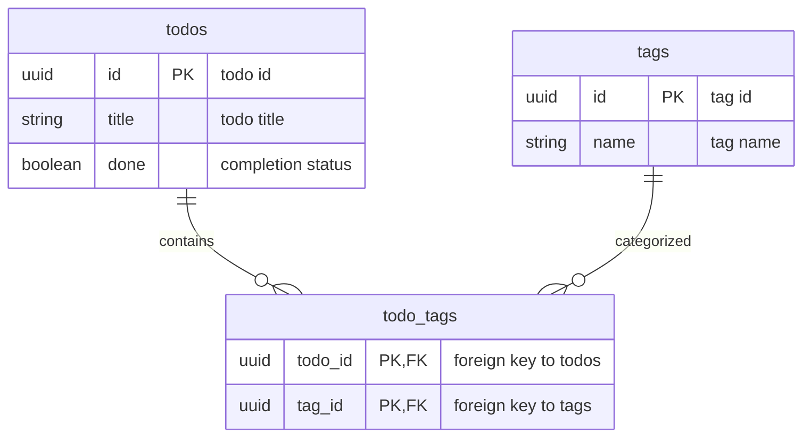

# ER Diagram

```mermaid
erDiagram
    todos ||--o{ todo_tags : contains
    tags ||--o{ todo_tags : categorized
    todos {
        uuid id PK "todo id"
        string title "todo title"
        boolean done "completion status"
    }
    tags {
        uuid id PK "tag id"
        string name "tag name"
    }
    todo_tags {
        uuid todo_id PK,FK "foreign key to todos"
        uuid tag_id PK,FK "foreign key to tags"
    }
```
