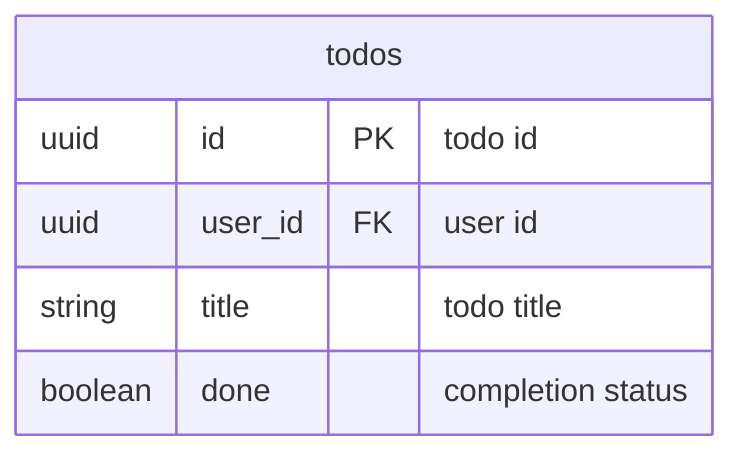

# ER Diagram

```mermaid
erDiagram
    %% users ||--o{ todos : contains
    %% users ||--o{ tags : contains
    %% todos ||--o{ todo_tags : contains
    %% tags ||--o{ todo_tags : categorized
    
    %% users{
    %%     uuid id PK "user id"
    %%     string name
    %% }
    todos {
        uuid id PK "todo id"
        uuid user_id FK "user id"
        string title "todo title"
        boolean done "completion status"
    }
    %% tags {
    %%     uuid id PK "tag id"
    %%     uuid user_id PK,FK "user id"
    %%     string name "tag name"
    %% }
    %% todo_tags {
    %%     uuid todo_id PK,FK "foreign key to todos"
    %%     uuid tag_id PK,FK "foreign key to tags"
    %% }
```
